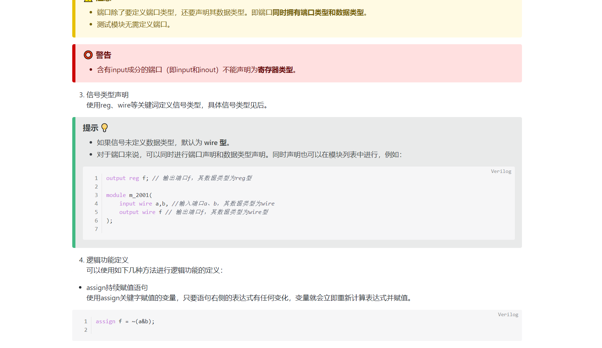

<h1 align="center"></h1>

  

<h1 align="center">
  Verilog初级教程
</h1>

  
  

  
   
  本项目使用AGPL-3.0开源协议

## 🧭 项目简介
本教程基于markdown编写，一般的编译器只能正常打开部分内容，如需显示所有内容，请使用[**Yank Note**](https://github.com/purocean/yn)打开该文件。
一份从零开始入门Verilog的小文档，学完本文档的内容，你将可以初步上手编写Verilog代码进行仿真与测试。
我也会将md文件转换为pdf和~~html~~（无法导出正确的mermaid图）方便大家阅读。
## 🍔 食用方法
下载md文件或pdf文件均可，按顺序学习即可！
## 🤙 联系我
📥 Email: 931911761@qq.com

