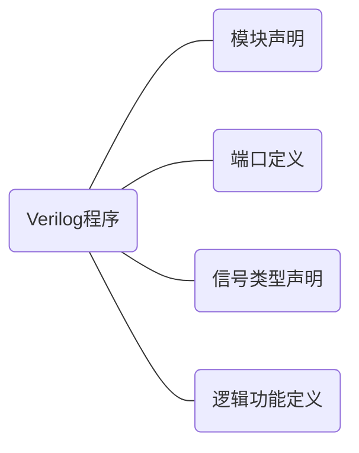

# Verilog
[toc]{level: [2,3,4]}
## Verilog 模块
每个Verilog程序均由以下四个部分组成。

1. 模块声明
```Verilog
module 模块名 (端口1,端口2,端口3, ...);\

```
2. 端口定义
```Verilog
input  端口1,端口2, ...; //输入端口
output 端口1,端口2, ...; //输出端口
inout  端口1,端口2, ...; //双向端口
```
::: warning ⚠️ 注意
- 端口除了要定义端口类型，还要声明其数据类型。即端口**同时拥有端口类型和数据类型**。
- 测试模块无需定义端口。
:::
::: danger ⭕ 警告
- 含有input成分的端口（即input和inout）不能声明为**寄存器类型**。
:::
3. 信号类型声明
使用reg、wire等关键词定义信号类型，具体信号类型见后。
::: tip 提示 💡
- 如果信号未定义数据类型，默认为 **wire 型**。
- 对于端口来说，可以同时进行端口声明和数据类型声明。同时声明也可以在模块列表中进行，例如：
```Verilog
output reg f; // 输出端口f，其数据类型为reg型

module m_2001(
    input wire a,b, //输入端口a、b，其数据类型为wire
    output wire f // 输出端口f，其数据类型为wire型
);

```
:::

4. 逻辑功能定义
可以使用如下几种方法进行逻辑功能的定义：
- assign持续赋值语句
使用assign关键字赋值的变量，只要语句右侧的表达式有任何变化，变量就会立即重新计算表达式并赋值。
```Verilog
assign f = ~(a&b);

```
- always过程块
使用always描述组合电路与时序电路
```Verilog
always @(*)
begin
    f = ~(a&b);
end
```
上述语句与assign语句完全等效，原理见后。
- 使用各类元件
使用Verilog内置好的门元件、开关级元件等。
```Verilog
and a3(out, a, b, c); //调用三输入与门

```
## Verilog 通用模板
```Verilog
    /*----模块定义----*/
module <模块名> (<端口列表>);

    /*----端口定义----*/
    input/output/inout 端口列表;

    /*----信号类型声明----*/
    wire/reg 信号列表;

    /*----逻辑功能定义----*/
    assign <信号名> = <表达式>;

    always@(<敏感信号列表>)
    begin
        //过程赋值（阻塞与非阻塞）
        //if-else case for语句
        //task function调用
    end

    <调用模块名> <例化模块名> (<端口列表>);
    门元件关键字 <例化元件名> (<端口列表>)
endmodule
```
## Verilog 语言要素
### 标识符
**标识符由[0-9] [a-z,A-z] '_' '$'组成**。
::: tip 提示 💡
- 标识符最长可以包含1023个字符。
- 标识符区分大小写
:::
::: warning ⚠️ 注意
- 标识符的**首字符必须为字母或'_'**。
- 转义标识符以符号'\\'开头，空白符结尾。**可以包含任何字符，可以以任意字符起手**，例如：
```
\7400 
\~#@sel
```
:::

### 整数常量
整数常量的格式按照如下方式书写：
```
+/-<位宽>'<进制><数字>
```
进制的表示方式：
- B/b : 二进制
- D/d : 十进制（默认）
- H/h : 十六进制
- O/o : 八进制

数字不仅可以是[0-9]，还可以是**x/X(不定值)**，**z/Z（高阻态）**。

::: warning ⚠️ 注意
- 位宽表示的是其**二进制宽度**，不应是当前进制下的宽度，需要转换为二进制的形式才能正确表示，在位拓展与位截断上也是以二进制宽度来截取。
```
8'hFF == 8'h000000FF //❌
8'hFF == 8'b11111111 //✔️
```
- 正负号需要写在最左侧，负数通常表示为二进制补码的形式。

- **' 与 进制**之间不允许出现空格，**数值之间**不允许出现空格。
```
8'h2A1B3 //✔️
8  'h2A1B3 //✔️
8'h  2A1B3 //✔️
8  'h  2A1B3 //✔️

8'  h2A1B3 //❌，'与进制之间有空格
8'h2A  1B3 //❌，数值之间有空格
```
- 可以使用'_'划开数字，但本身__无意义。
```
16'b1010110100101001 //✔️
16'b1010_1101_0010_1001 //✔️，且与上面的表示完全等价
```
- 未定义位宽，则默认为**32位**。
```
32'b00000000000000000000000000001101 //✔️
'b1101 //✔️，且与上面的表示完全等价
```
- 位拓展时，一般补0，若最高位为x或z，则补符。
```
10'b0000000010 //✔️
10'b10 //✔️，且与上面的表示完全等价

10'bxxxxxxx0x1 //✔️
10'bx0x1 //✔️，且与上面的表示完全等价
```
- 位截断时，先转换为二进制下的表示形式，然后根据位宽，从最高位向低位截断，如有需要可以再转换为原来的表示形式。
```
5'H0FFF //✔️
5'b0000111111111111 //✔️，且与上面的表示完全等价
5'b11111 //✔️，且与上面的表示完全等价
5'h1F //✔️，且与上面的表示完全等价
```
- x/z在不同进制下表示的宽度不一致，二进制为1位，八进制为3位，十六进制为4位。
```
8'o7x //✔️
8'b00111xxx //✔️，且与上面的表示完全等价

8'haz //✔️
8'b1010zzzz //✔️，且与上面的表示完全等价
```
- 位宽与进制均省略时，**默认为十进制数**。
```
32 //✔️，表示十进制的32
```
- 可以使用s代表带符号的整数
```
8'sh5a //✔️，表示十六进制带符号整数5a
```
:::
### 实数常量
1. 十进制表示法
```
2.0 //✔️
0.123 //✔️

2. //❌，小数点两侧均有数字
.5 //❌，小数点两侧均有数字
```
2.十进制科学计数法
格式：
<数值> e/E <整数数值>
```
4_3_5.1e2 //✔️
435.1e2 //✔️，且与上面的表示完全等价
435.1E2 //✔️，且与上面的表示完全等价
43510.0 //✔️，且与上面的表示完全等价
```
实数转整数的方式：**四舍五入**。
::: tip 提示 💡
负数的四舍五入要向负无穷舍，例如
```
-16.62 --> -17
-25.22 --> -25
```
:::
### 整数变量
格式如下：
```Verilog
integer counter;
counter = -1;
```
### 实数变量
格式如下：
```Verilog
real delta;
delta = 4e10;
delta = 2.13;
```
### 字符串
字符串必须是双引号内的字符序列，**不可多行书写**。
```
"Hello world!" //✔️

"Hello
 world!" //❌
```
采用**reg型变量**存储字符串，每个字符是**8位ASCII码**。
对变量赋值时，如果少于或多余原来设置的reg大小，则发生位截断与位拓展现象。
```Verilog
reg [8*12:1] str;
initial
begin
    str = "Hello World!"; // 实际存储 Hello World!
    str = "Hello!"; // 实际存储 Hello!，在数字进制下高位补0
    str = "Hello Wooooooooooorld!"; // 实际存储 Hello Wooooo
end
```
### 特殊字符
特殊字符 | 说明
:-----------:|:--------------:
\n | 换行符
\t| Tab缩进符
\\\ | 符号反斜杠
\\" | 符号双引号
\ddd（ddd为八进制数） | 表示ddd对应的ASCII字符 

### 数据类型
数据类型是用来表示数字电路中的物理连线，数据存储和传输单元等物理量。

Verilog中**所有数据类型**都在以下四个值中取值：
- 0 ---- 低电平/逻辑0
- 1 ---- 高电平/逻辑1
- x/X -- 不定或未知的逻辑状态
- z/Z -- 高阻态

::: warning ⚠️ 注意
- 只有0、1、z可综合。
- 只有端口变量可以赋值为z。
:::


| net型 | variable型 |
| -- | -- | 
| wire | reg |
| tri | integer |
| ... | ... |
[Verilog两类数据类型]

#### net型
net型数据相当于**硬件电路的物理连接**，特点是随着输入值的变化而变化。

::: warning ⚠️ 注意
- **net型值不接受直接的赋值**。
- 未赋值的net型变量为**高阻态z**（除trireg以外）。
:::

1. wire型
wire是最常用的net型数据变量，一般wire用来定义Verilog模块中的**输入/输出信号**。
多位的wire型变量，也称**wire型向量(Vector)**，可以使用[n-1:0]或[n:1]的方式定义，两种方式的宽度是等价的。
```Verilog
wire a; //定义wire型变量a，宽度为1位
wire [7:0] b; //定义wire型变量b，宽度为8位
wire [8:1] c; //定义wire型变量c，宽度为8位，与上述语句的宽度完全一致
```
2. tri型（非重点）
与wire的用法与功能上完全一致，仅仅是为了更清楚表示该信号综合后的电路连线具有三态功能。

#### variable型变量
variable型变量必须位于过程语句，通过**赋值语句**赋值。

1. reg型
reg是最常用的variable型数据变量。
多位的reg型变量，也称**reg型向量(Vector)**，可以使用[n-1:0]或[n:1]的方式定义，两种方式的宽度是等价的。

```Verilog
reg a; //定义reg型变量a，宽度为1位
reg [7:0] b; //定义reg型变量b，宽度为8位
reg [8:1] c; //定义reg型变量c，宽度为8位，与上述语句的宽度完全一致
```
::: warning ⚠️ 注意
- reg变量既可以是寄存器或触发器，也**可以是连线**。综合器会根据实际情况来映射，例如：
```Verilog
module abc(
    input a, b, c, output f1, f2
);
    reg f1, f2;
    always @(a or b or c)
    begin
        f1 = a | b;
        f2 = a & c;
    end
endmodule
上述例子综合完毕后，f1和f2会映射为连线。
```
- 使用[n-1:0]和[n:1]的宽度等价，但其下标使用范围不一致。例如：
```Verilog
reg [8:1] aa;
aa[0] = 1; //❌，因为没有下标为0的位置
```
:::

### 参数
用parameter来定义符号常量。
参数的格式：
```Verilog
parameter <参数名1> = <表达式>, <参数名2> = <表达式>, ... ;

parameter SEL = 8, CODE = 8'ha3; 
//为参数SEL赋值位十进制的8，为参数CODE赋值十六进制的a3
```
用localparam可以定义局部参数，**仅限于本模块，不可用于参数传递**。
#### 参数的传递（重载）
高层模块中例化底层模块时，可以在高层模块中直接修改内部定义的参数。
1. 隐式传递
使用'#'符号进行重载，这种重载方式需要和原参数列表**一一对应且不可跳过**，例如：
```Verilog
module add8
    #(parameter MSB = 8,LSB = 0) (
        input[MSB-1:LSB] a,b
    );
    // ...
endmodule


add8 #(16,0) u1 (a,b);
// 例化add8子模块，其中参数MSB修改为16
```
2.显式传递
类似于例化的名称关联方式，也可以显示地传递参数，这种传递方式**不受位置影响**。
```Verilog
module add8
    #(parameter MSB = 8,LSB = 0) (
        input[MSB-1:LSB] a,b
    );
    // ...
endmodule


add8 #(.LSB(0),.MSB(16)) u2 (a,b);

// 例化add8子模块，其中参数MSB修改为16
```
3.defparam传递

```Verilog
module add8
    #(parameter MSB = 8,LSB = 0) (
        input[MSB-1:LSB] a,b
    );
    // ...
endmodule

defparam u3.MSB = 16, u3.LSB = 0;

add8 u3 (a,b);
// 例化add8子模块，其中参数MSB修改为16
```

### 向量
前置内容已经涉及了向量，总的来说，**位宽大于1**的变量称为向量。

#### 位选择和域选择
表达式中可以任选向量中的一位或相邻几位，分别称为位选择和域选择。
域选择时，高位与高位对齐，然后向低位依次赋值。
```Verilog
reg [7:0] a,b; //两个八位寄存器，a[7]和b[7]为最高有效位
reg [3:0] c; //一个四位寄存器，c[3]是最高有效位
reg [0:3] d; //一个四位寄存器，d[0]是最高有效位

A = a[6]; // 位选择
A = a[3:0]; // 域选择

b[5:2] = c;
/*
* 等效于
* b[5] = c[3];
* b[4] = c[2];
* b[3] = c[1];
* b[2] = c[0];
*/
```

### 存储器
存储器是一种**特殊的二位向量**。拥有**单元数和位宽（字长）两个属性**。
存储器的格式如下：
```Verilog
    <数据类型> (<[high1:low1]>) 存储器名 <[high1:low2]>;

    reg [3:0] mymem [63:0];
    // 定义了一个存储器mymem，拥有64个单元，每个单元的位宽为4位。
```
::: warning ⚠️ 注意
只允许对存储的某一个单元进行赋值，例如：
```Verilog
    reg [3:0] mymem [63:0];
    
    mymem[2] = 12; //✔️
    mymem[61] = 8'b10011111; //✔️
```
:::

#### 寄存器与存储器的区别（重点）
中括号在前和在后所表示的含义完全不一致，为了区分，以下举几个常见的例子：
```Verilog
reg [7:0] a1;
//定义了一个8位寄存器a1，最高有效位为a1[7]


reg a2 [7:0];
//定义了一个8个单元的存储器a2，每个单元的位宽为1位
//未指出位宽（字长），默认为1


reg [7:0] a3 [7:0];
//定义了一个8个单元的存储器a2，每个单元的位宽为8位


a1 = 8'b11001100; //✔️,对寄存器a1整体赋值，合法
a1[0] = 1'b1; //✔️，对寄存器a1的第0位赋值，合法


a2[0] = 1'b1; //✔️，对存储器a2的第0个单元赋值，合法
a2 = 8'b11001100;//❌，对存储器a2整体赋值，非法


a3[0] = 1'b1; //✔️，对存储器a3的第0个单元赋值，合法
//数值会经过位拓展，实际存储为8'b00000001

a3[3] = 8'b11001100;//✔️，对存储器a3的第3个单元赋值，合法
```

### 运算符
与C类似，使用运算符对变量和常量之间进行运算，也是Verilog逻辑功能定义的核心。
#### 算数运算符
- \+ 加
- \- 减
- \* 乘
- \\ 除
- % 取余

#### 逻辑运算符
逻辑运算符的结果只有1和0。
- && 逻辑与
- || 逻辑或
- ! 逻辑非
::: warning ⚠️ 注意
参与逻辑运算的数值，**只要有任何一位是非零值，该值整体看为1进行运算**。
:::

#### 位运算符（重点）
- ~ 按位取反
- & 按位与
- | 按位或
- ^ 按位异或
- \^\~/~^ 按位同或

::: warning ⚠️ 注意
- 对于x（不定值）进行位运算时：
0 & x = 0，因为0与任意值与均为0。
1 | x = 1，因为1与任意值或均为1。
0/1 \^\~/~^ x = x，因为异或与同或运算均要参考两边的值。

- 对于位宽不一致的值进行位运算，使短位宽的值进行**位拓展**，例如：
```Verilog
A = 5'b11001;
B = 3'b100;

A | B == 5'11101 //✔️
//等价于5'b11001和5'b00100进行按位或
```
:::

#### 关系运算符
- < 小于
- <= 小于等于
- \> 大于
- \>= 大于等于
::: warning ⚠️ 注意
- 如果任何一边的数值**任意一位存在不定值**，返回值也为不定值。
:::

#### 等式运算符（重点）
- == 等于
- != 不等于
- === 全等
- !== 不全等
::: warning ⚠️ 注意
- 对于全等和不全等运算符来说，即使是x（不定值）和z（高阻），也会进行比较，存在以下规则：
```Verilog
x === x //逻辑1
z === z //逻辑1
x === z //逻辑0
x === 1 //逻辑0


a = 5'b11x01;
b = 5'b11x01;

a == b //逻辑0，因为存在x不定值
a === b //逻辑1，因为完全一致
```

:::

#### 缩减运算符
将多位宽的数值通过逐位运算缩减为位宽为1的数值。
- & 逐位与
- ~& 逐位与非
- | 逐位或
- ~| 逐位或非
- ^ 逐位异或
- \^\~/~^ 逐位同或

```Verilog
reg [3:0] re;
a = &re 
//等价于 re[3] & re[2] & re[1] & re[0]
b = ~|re
//等价于 ~(~(~(re[3] | re[2]) | re[1]) | re[0])
```

#### 移位运算符
算数移位会保持其数值符号。
- \>> 右移
- << 左移
- \>>> 算数右移
- <<< 算数左移

#### 指数运算符
可以实现 $a^b$ 的效果。
- ** 指数运算符

#### 条件运算符
满足条件执行第一个语句，否则为第二个语句。
- ? :

#### 位拼接运算符（重点）
可以简化赋值，也可以使用这种复制法来进行一些巧妙的运算。
```Verilog
input [3:0] ina,inb;
input cin;
output [3:0] sum;
output cout;
assign {cout,sum} = ina + inb + cin;
//ina，inb和cin加起来是4位或5位的数值。
//使用这种办法可以自动切分结果数值
//将[3:0]的部分赋给sum，[4]的部分赋给cout

a = {2{3'b101}};
//等价于
//a = 6'b101101;

b = {3{a,b}};
//等价于
// b = {a,b,a,b,a,b};

wire [7:0] data;
data = 8'b10001111
s_data = {4{data[7]}, data};
//将data的最高位（符号位）复制4次，然后接在data之前，完成位拓展
```

## Verilog 语句语法

### 过程语句
#### initail
常用于仿真初始化，只执行一次。
格式如下：
```Verilog
initail
begin
    //...
end
```
#### always
敏感触发过程块，只要列表中的信号有更新，always下的过程块就会执行，次数不定。
格式如下：
```Verilog
always @(<敏感信号列表>)
begin
    //...
end
```
敏感信号列表的几种表达形式：
```Verilog
always @(a) //当a发生改变时
always @(a or b or c) //当a，b，c任意一个发生改变时
always @(a, b, c) //与上式完全等价，当a，b，c任意一个发生改变时
always @(posedge clock) //当clock上升沿到达时
always @(negedge clock) //当clock下降沿到达时
always @(*) // 所有信号变量，当任意一个发生改变时
```
### 块语句
#### 串行块begin-end
顾名思义，语句依次执行。
一个初始值为0，每隔10个时间单位进行一次翻转的信号sign，一共翻转5次，其串行实现为：
```Verilog
initail
begin
    #0 sign = 0;
    #10 sign = ~sign;
    #10 sign = ~sign;
    #10 sign = ~sign;
    #10 sign = ~sign;
    #10 sign = ~sign;
end
```
#### 并行块fork-join
顾名思义，语句同时并行执行。
一个初始值为0，每隔10个时间单位进行一次翻转的信号sign，一共翻转5次，其并行实现为：
```Verilog
initail
fork
    sign = 0;
    #(10 * 1) sign = ~sign;
    #(10 * 2) sign = ~sign;
    #(10 * 3) sign = ~sign;
    #(10 * 4) sign = ~sign;
    #(10 * 5) sign = ~sign;
join
```
#### 赋值语句
##### 持续赋值语句
assign为持续赋值语句，主要用于对wire型变量的赋值
格式如下：
```Verilog
assign 信号 = <表达式>;
```
##### 过程赋值语句(重点)
1. 阻塞赋值
使用符号'='赋值，在前序阻塞赋值结束后，会立即赋值。
2. 非阻塞赋值
使用符号'<='赋值，非阻塞赋值等待过程块结束完毕后，才会进行同步赋值。

#### 条件语句
##### if-else语句
表达式通常为一个逻辑表达式或关系表达式。
::: warning ⚠️ 注意
- 当表达式为非1值（0、x、z）时，均按假，即0值处理。
:::
格式如下：
```Verilog
if(表达式) 语句1; //非完整性if语句，尽量不使用

if(表达式) 语句1; //完整性if语句
else 语句2;

if(表达式) 语句1; //多重选择if语句
else if(表达式) 语句2;
else if(表达式) 语句3;
...
else 语句n;
```
##### case语句(重点)
格式如下：
```Verilog
case (表达式)
    值1 : 语句1;
    值2 : 语句2;
    ...
    default 语句n;
endcase
```
#### 循环语句
##### for循环
格式如下：
```Verilog
for(循环变量初值；循环结束条件；循环变量增值)
    执行语句;
```
::: danger ⭕ 警告
- Verilog不存在i++这样的语法，使用i=i+1这样的语句代替。
:::

##### repeat循环
一种可指定循环的次数循环方式。
格式如下：
```Verilog
repeat(循环次数) 执行语句;
```
##### forever循环
永久循环，一般用来产生周期性波形。
```Verilog
forever 执行语句;
```

### 任务与函数
#### 任务
格式如下：
```Verilog
task <任务名>;
    端口及数据类型声明语句;
    其他语句;
endtask
```
任务调用的格式：
```Verilog
<任务名>(端口1, 端口2, ...)
```
::: warning ⚠️ 注意
- 任务定义与调用必须在同一个module中。
- 任务没有端口名，但紧接着必须进行端口的定义。
- 任务调用的端口名列表必须与任务定义时相一致。
- 任务可以调用任意多的其他任务和函数。
:::
#### 函数
格式如下：

```Verilog
function <返回值位宽或类型说明> 函数名;
    端口声明;
    局部变量定义;
    其他语句;
endfunction
```

::: warning ⚠️ 注意
- <返回值位宽或类型说明>是可选的，如果缺省，啧返回位宽为1位的寄存器类型数据。
:::
函数调用的格式：
```Verilog
<函数名> (<表达式><表达式>);
```
::: danger ⭕ 警告
- 不允许在函数中启动任务。
- 不允许在函数中有时间控制语句。
:::
## Verilog 设计的层次与风格
### 描述电路
分为三种描述方式
#### 结构描述
常用**门级结构描述**。
多采用已有的功能模块或（门）元件进行例化。

门元件的调用
```Verilog
门元件名 <例化门元件名> (输出,输入1,输入2, ...);
```
| 关键字 | 门名称 |
| -- | -- | 
| and | 与门 |
| nand | 与非门 |
| or | 或门 |
| nor | 或非门 |
| xor | 异或门 |
| xnor | 同或门 |
| not | 非门 |
| ... | ... |
[常用内置门元件]
#### 行为描述
多采用**always过程语句**或**initail过程语句**，比较类似传统高级语言的过程语句。
#### 数据流描述
多采用**assign持续赋值语句**实现，类似传统的数电逻辑表达式设计。
### 时序逻辑设计

## Verilog 有限状态机
### 状态编码
常用的编码方式有四种：
#### 顺序编码
即按照**二进制自增**的编码方式。
#### 格雷编码
由顺序编码，从低位开始**两两异或**取得，最高位向下拉即可。
#### 约翰逊编码
最高位取反，左移一次，然后送到最低位。
#### 一位热码编码
只有一位1，1的位置向最高位前进。
#### 各类编码对比及区别
| 状态 | 顺序编码 | 格雷编码 | 约翰逊编码 | 一位热码编码 |
| -- | -- | 
| state0 | 0000 | 0000 | 00000 | 00000001|
| state1 | 0000 | 0000 | 00001 | 00000010|
| state2 | 0000 | 0000 | 00011 | 00000100|
| state3 | 0000 | 0000 | 00111 | 00001000|
| ... | ... | ... | ... | ... |
[4种编码对比]
::: tip 提示 💡
各类编码的区别如下：
- 顺序编码
缺点：**瞬变次数多，容易产生毛刺，引发逻辑错误**。
- 格雷编码
优点：**瞬变次数少，减少毛刺和暂态的可能性**。
- 约翰逊编码
不知道
- 一位热码编码
优点：**有效节省和简化译码电路，有效提高电路的速度和可靠性，提高器件资源的利用率**。
:::
#### 状态编码的定义方式
##### parameter参数定义
```Verilog
parameter ST1 = 2'b00, ST2 = 2'b01, 
    ST3 = 2'b10, ST4 = 2'b11;
```

##### `define语句定义（重点）
```Verilog
`define ST1 2'b00 //没有分号！！！
`define ST2 2'b01 
`define ST3 2'b10
`define ST4 2'b11
case(state)
    `ST1: //...; //要加撇
    `ST2: //...;
    //... 
endcase
```

##### localparam语句定义
```Verilog
localparam ST1 = 2'b00, ST2 = 2'b01, 
    ST3 = 2'b10, ST4 = 2'b11;
```
::: tip 提示 💡
- parameter方式：
作用域为**本模块**，可被上层模块重新定义，即**参数传递**。
- `define方式；
作用域为**整个工程**，可跨模块。一般将定义语句放在**模块外**。
- localparam方式：
作用域**局限本模块**，不可参数传递，用于**状态机参数**的定义。
:::
## Verilog 仿真
### 系统任务与系统函数
#### \$display与\$write及\$monitor
用于显示模拟的结果，唯一区别是**ㅤ\$display可以自动换行**，而$wirte不行。
monitor是一种特殊的打印，**当输出变量名列表发生改变时，就会输出一次**。
格式如下：
```Verilog
$display("格式控制符", 输出变量名列表);
$write("格式控制符", 输出变量名列表);
$monitor("格式控制符", 输出变量名列表);
```
#### 'timescale
`timescale语句用于定义模块的时间单位和时间精度。
格式如下：
```Verilog
`timescale <时间单位>/<时间精度>;
```
用来表示时间度量的符号有**s、ms、us、ns、ps、fs**。
```Verilog
`timescale 1ns/100ps;
```
上述语句表示延时单位为1ns，延时精度为100ps，即精确到0.1ns。

## Verilog 编程技巧
### 常用设计模块
#### D触发器
```Verilog
module dff(clk, din, dout);
    input clk, din;
    output reg dout;
    always @(posedge clk)
    begin
        dout <= din;
    end
endmodule
```
#### 带低电平复位的D触发器
```Verilog
module dff_rst(clk, rst, din, dout);
    input clk, rst, din;
    output reg dout;
    always @(posedge clk)
    begin
        if(!rst)
            dout <= 1'b0;
        else
            dout <= din;
    end
endmodule
```
#### 译码器
```Verilog
module decoder(enable, selete, z);
    parameter SELECT_WIDTH = 2; //输入端位宽参数，可以进行参数传递
    localparam Z_WIDTH = (1 << SELECT_WIDTH); //输出端位宽，由输入端计算而来

    input enablel;
    input [SELETE_WIDTH - 1:0] selete;
    output [Z_WIDTH - 1:0] z;
    always @(enable or selete or z)
    begin
        // 译码
    end
endmodule
```
### 移位寄存器


```Verilog
module dff(clk, clr, din dout);
    always @(posedge clk)
    begin
    if (!rst)
        dout <= 1'b0;
    else
        dout <= din;
    end
endmodule

`timescale 1ns/100ps
module main(clk, clr, din, Q);
    input clk, clr;
    input [3:0] din;
    input seri_in;
    output reg [3:0] Q;
    dff dff1 (.clk(clk), .clr(clr), .din(seri_in), .dout(Q[0]));
    dff dff2 (.clk(clk), .clr(clr), .din(Q[0]), .dout(Q[1]));
    dff dff3 (.clk(clk), .clr(clr), .din(Q[1]), .dout(Q[2]));
    dff dff4 (.clk(clk), .clr(clr), .din(Q[2]), .dout(Q[3]));

endmodule
```
### 激励测试文件
```Verilog
`timescale 1ns/100ps
module test;
reg a, b, c;
forever #50 c = ~c;
//时钟波形，每50个时间单位翻转一次，100个时间单位为一个周期

initail
begin
    a = 0;
    b = 0;
    c = 0;

    #100 a = 1;
    #100 b = 1;
    #200 $stop;
end
```